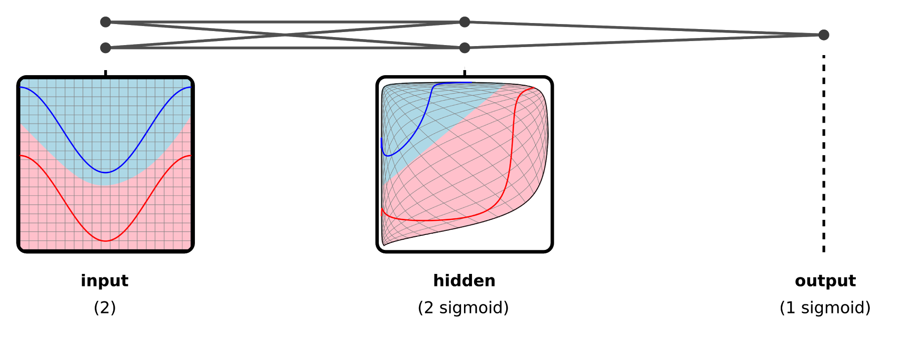

# Neural Networks

## 1. “Deep learning is an ad-hoc field” — what that means

* Modern deep learning **works extremely well**
* But our *theoretical understanding* of *why* it works is weak and fragmented
* Many details feel arbitrary:

  * architectures change every few years
  * tricks matter a lot
  * explanations come *after* success, not before

This is typical of **young sciences**.

The historical analogies (taxonomy, chemistry) are important:

* Early practitioners did useful work
* But they misunderstood what they were *really* doing
* Later discoveries completely reframed the field

So the claim is **not**:

> “Deep learning is sloppy or wrong”

But:

> “We are probably misinterpreting what deep learning fundamentally is.”

---

## 2. The “successful tool” problem

The “extremely successful tool” is basically:

> **Backpropagation + gradient descent on neural networks**

* Backprop works, but feels *accidental*
* Small design choices matter a lot
* There’s no single, clean conceptual core yet

This is a red flag historically:

* When a field relies on a magical hammer
* But lacks a unifying theory
* It’s usually pre-theory, not post-theory

---

## 3. Competing narratives of deep learning

Right now, people explain deep learning using **different stories**:

### 1. Neuroscience narrative

* Neural nets ≈ brains
* Learning ≈ synapses adapting
* Mostly metaphorical at this point

### 2. Probabilistic narrative

* Networks infer latent variables
* Learning ≈ approximate Bayesian inference
* Powerful, but often forced

### 3. Representations narrative

* Data lies on manifolds
* Layers reshape data into simpler forms
* Tasks become easy in the right representation

---

## 4. The new speculative move

Here’s the *new* idea:

> The representations narrative in deep learning corresponds to **type theory** in functional programming.

This is the key leap.

So instead of saying:

* “Neural networks are like brains”
* or “Neural networks are probabilistic models”

We can suggests:

> “Neural networks are optimized programs built from composed functions.”

And more strongly:

> “Deep learning studies the relationship between **optimization** and **function composition**.”

---

## 5. Why functional programming?

Functional programming focuses on:

* Functions
* Composition
* Types
* Laws about how functions interact

Deep learning does **exactly this**, but:

* With *learned* functions
* With *learned* intermediate structures (representations)
* With optimization instead of logic or proof



Each layer:
  ```
  f_n ∘ f_(n-1) ∘ ... ∘ f_1
  ```

* Is a function
* Takes an input of some “type” (representation)
* Produces an output of another “type”

The whole network:

* Is a deeply composed function
* Trained by optimization

---

## 6. What “optimization & function composition” really means

This is the heart of the argument.

### Classical programming

* You **design** functions
* You **declare** types
* You **prove** correctness

### Deep learning

* You **optimize** functions
* You **discover** representations (types)
* You **measure** correctness statistically

So deep learning might be:

> A new way of constructing programs
> where optimization replaces design.

This is a *huge* conceptual shift.

---

## 7. Why this might be fundamental


Reasons it feels “right”:

1. **Universality**

   * Every deep learning model = composed functions + optimization

2. **Abstraction**

   * Representations behave like types
   * Layers behave like typed functions

3. **Unification**

   * Connects geometry (manifolds)
   * Logic (types)
   * Computation (functions)
   * Learning (optimization)

4. **Historical precedent**

   * Other fields eventually unified around simple cores
   * Example: “Everything is atoms”
   * Or: “Everything is evolution”

---

## 8. Why this is speculative (and honest)

* Not claiming this is *true*
* Only that it is *plausible*
* And *beautiful*

This is important:
they’re saying:

> “If deep learning matures, this is a direction it *could* settle into.”

---

## 9. The final punchline

> **Every deep learning model optimizes a composition of functions.**

Strip away:

* biological metaphors
* probabilistic stories
* architectural fashions

What remains is:

* functions
* composition
* optimization

That might be the **real object of study**.

---

## 10. One-paragraph summary

Deep learning today feels ad-hoc because we don’t yet know what it fundamentally is. The author suggests that, in hindsight, we may see deep learning as the study of *optimized function composition*, where representations play the role of types and learning replaces explicit program design. This would place deep learning at the intersection of optimization, geometry, and functional programming — not as a quirky engineering trick, but as a new way of constructing computation itself.
