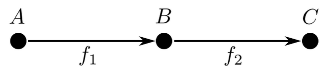
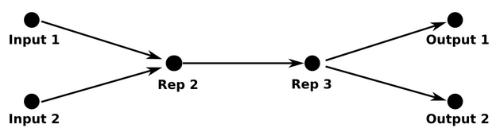

# Representations in neural networks

## 1. What is a “representation” in deep learning?

When raw data enters a neural network, it usually isn’t in a form that makes the task easy.

* Pixels aren’t “edges”
* Edges aren’t “faces”
* Faces aren’t “age” or “gender”

Each layer of a neural network **transforms** the data into something more useful.
That transformed version is called a **representation**.

Example:

* Input: a 224×224×3 RGB image (raw pixels)
* Early layers: detect edges and textures
* Middle layers: detect shapes or parts
* Late layers: detect abstract concepts (dog, smile, age, etc.)

So a representation is:

> “The way the network currently understands the data.”

Mathematically, you can think of it as embedding the data into a vector space of some dimension ( n ).

---

## 2. What is a “type” in computer science?

In programming, a **type** tells you:

* What kind of data something is
* What operations are valid on it

Examples:

* An `int` is different from a `string`
* A function `f : A → B` can only accept inputs of type `A`
* You can only compose `f : A → B` with `g : B → C`

Types enforce **meaningful composition**.

If you try to pass the wrong type, the program doesn’t make sense.

---

## 3. The core analogy: representations ≈ types

Here’s the key insight:

### Representations in neural networks play the same role that types play in programs.

| Programming           | Deep Learning                      |
| --------------------- | ---------------------------------- |
| Type                  | Representation                     |
| Function              | Layer                              |
| Function composition  | Layer stacking                     |
| Type mismatch = error | Representation mismatch = nonsense |

In both cases:

* Data must be in the **right form**
* Otherwise, the next operation cannot interpret it correctly

> “Data in the wrong representation is nonsensical to a neural network” is the deep-learning version of “Passing the wrong type to a function is an error.”

---

## 4. Why layer compatibility matters

When you stack layers:



> A layer f1 followed by a layer f2 The output representation of f1 is the input of f2

```
f₁ → f₂
```

* `f₁` outputs data in some representation
* `f₂` expects data in some representation

These must **agree**, just like function types must agree.

In simple, linear networks, this is boring:

* You design the architecture
* Dimensions match
* Done

But in **complex architectures**, this becomes meaningful.

---

## 5. Multiple inputs, multiple outputs → shared representations

Consider a network that:



* Takes **RGB images**
* Takes **grayscale images**
* Predicts **age**
* Predicts **gender**

Instead of separate networks, you:

* Map all inputs into a **shared internal representation**
* Perform multiple tasks from that same representation

This is like saying:

> “Different data types get coerced into a common intermediate type.”

The network learns:

* What aspects of images are common across tasks
* What features matter for all outputs

---

## 6. Why shared representations are powerful

This is where things get exciting.

### Language-to-language

Map words from two languages into the **same embedding space**:

* Similar meanings cluster together
* Translation emerges without supervision

### Image–text models

Map images and words into the **same representation space**:

* “A photo of a zebra” and an image of a zebra land near each other
* Enables zero-shot classification (classifying things never seen before)

This works because:

> Meaning is encoded in the structure of the representation space.

---

## 7. Manifolds: the geometric view

Deep learning often describes data as lying on a **manifold**:

* A low-dimensional structure embedded in high-dimensional space

Each layer:

* “Bends” the manifold
* Straightens out the task
* Makes decision boundaries easier

Types do something similar:

* They carve out **valid regions of computation**
* They enforce logical structure on values

So:

* **Representations** = geometric constraints
* **Types** = logical constraints

---

## 8. Why this connection might be fundamental

There’s a deep, well-known correspondence in math and CS between:

* **Logic**
* **Types**
* **Category theory**
* **Topology and geometry**

The text is hinting that:

> Neural networks may be discovering *geometric analogues* of type systems.

In other words:

* Types ensure *meaningful composition* in programs
* Representations ensure *meaningful composition* in neural networks

Both are systems for:

> Turning raw symbols or data into structured, interpretable meaning

---

## 9. Big picture intuition

You can summarize the idea like this:

* A **type** is “what kind of thing this value is”
* A **representation** is “what kind of thing this data means”
* Layers and functions only work if those “kinds” line up
* Learning is the process of *negotiating a shared internal language*

That’s why this analogy feels so deep:
both programming languages and neural networks are ultimately about **structure, meaning, and composition**.

Nice, let’s do a **very concrete example** and walk it step by step. I’ll give you **two parallel examples** side-by-side: one from **programming (types)** and one from **neural networks (representations)**.

---

## Examples

### Example 1: Function composition vs layer composition

---

**Programming (types)**

Suppose you have these functions:

```text
f1 : String → Int
f2 : Int → Bool
```

You can compose them:

```text
f2 ∘ f1 : String → Bool
```

Why does this work?

* `f1` outputs an `Int`
* `f2` expects an `Int`

Now imagine this:

```text
f3 : Image → Vector[512]
f4 : Vector[128] → Label
```

You **cannot** compose `f4 ∘ f3` because:

* `f3` outputs `Vector[512]`
* `f4` expects `Vector[128]`

Even though both are “vectors”, the *type* doesn’t match.

---

**Neural network (representations)**

Now translate that directly into deep learning.

```text
Layer 1: Image → 512-dim representation
Layer 2: 512-dim → 10 classes
```

Works perfectly.

But this fails conceptually:

```text
Layer 1: Image → texture-based representation
Layer 2: expects object-level representation
```

Even if the **dimensions match**, the **meaning does not**.

The network won’t learn well because:

> Layer 2 is interpreting the data as “objects” while layer 1 is producing “textures”.

That’s a **representation mismatch**, just like a type mismatch.

---

### Example 2: Shared representation (multi-task learning)

**Programming analogy**

Imagine two functions:

```text
parse_json : JSON → User
parse_xml  : XML  → User
```

Once data is converted to the **User** type, everything downstream is shared:

```text
send_email : User → EmailStatus
predict_churn : User → Probability
```

JSON and XML are different input types, but once mapped into `User`, the rest of the system doesn’t care.

---

**Neural network version**

Now the neural network equivalent:

```text
RGB image      ┐
Grayscale image ├──→ Shared representation → age prediction
Infrared image ┘                          → gender prediction
```

Each input has its own encoder:

* RGB encoder
* Grayscale encoder

But all of them map into the **same representation space**.

That shared space is like the `User` type:

* It captures what matters
* It hides irrelevant differences

---

### Example 3: Word translation (this one is famous)

**Programming intuition**

Think of this type:

```text
Meaning
```

Now imagine:

```text
english_word : String → Meaning
french_word  : String → Meaning
```

Once two words map to the **same Meaning**, they are translations.

---

**Neural network reality**

In word embeddings:

* `"dog"` → vector
* `"chien"` → vector

Training forces both vectors into the **same region of embedding space**.

So:

* `"dog"` and `"chien"` end up near each other
* The network never explicitly learned translation rules

This is like **type inference**:

> The model discovers a shared type (“meaning”) without being told.

---

### Example 4: Image–text models (CLIP-style)

**Types view**

You want:

```text
Image → Meaning
Text  → Meaning
```

Then:

```text
Meaning → Class
```

If images and text didn’t share a representation (type), this would be impossible.

---

**Neural network view**

CLIP does exactly this:

* Image encoder maps images → embedding space
* Text encoder maps text → same embedding space

Then similarity is just **distance** in that space.

This is why CLIP can classify images of things it’s never seen:

* The *representation* already encodes the type “thing described by text”

---

### Example 5: Why training is “negotiation”

Here’s the subtle but important part.

In programming:

* Types are fixed ahead of time
* Compiler enforces them

In neural networks:

* Representations are **learned**
* Adjacent layers **co-adapt**

Layer 1 learns:

> “I should output something Layer 2 understands”

Layer 2 learns:

> “I should expect what Layer 1 tends to produce”

This is like **two functions jointly inferring a type** rather than having it declared.

---

## One-sentence summary

> A type is what a function *expects*; a representation is what a layer *expects*. Learning is the process of inventing the types.

