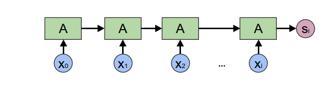
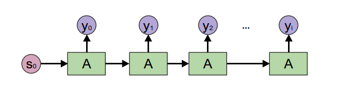
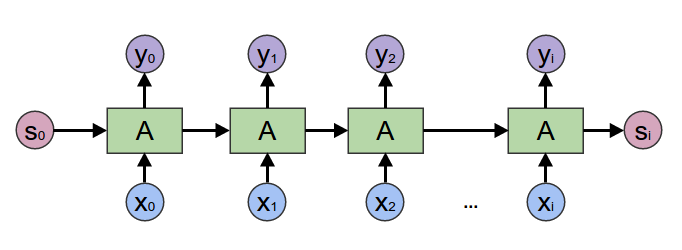
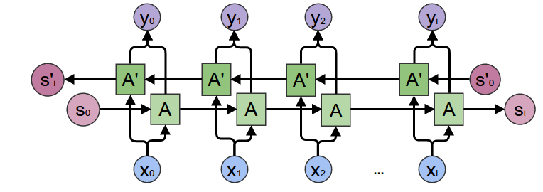
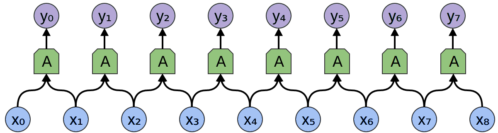
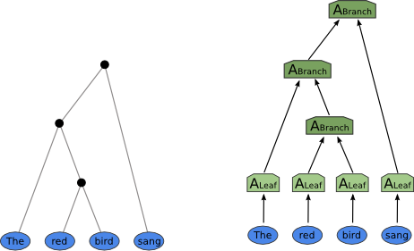

# Weight Tying

## 1. The big idea first

The core claim of this section is:

> **Modern neural networks work because they reuse the same computation many times, just like functions in programming.**

That reuse is called **weight tying** in deep learning.

In functional programming, reuse is achieved by:

* writing a function once
* applying it many times
* possibly in structured ways (map, fold, etc.)

The author is saying:

> Neural network architectures are not ad-hoc tricks — they are *functional programming patterns with learnable functions inside*.

---

## 2. Weight tying = functions

### In programming

If you wrote:

```text
y1 = x1 * 3
y2 = x2 * 3
y3 = x3 * 3
...
```

You’d refactor to:

```text
f(x) = x * 3
map f [x1, x2, x3, ...]
```

Why?

* Less code
* Fewer bugs
* More structure
* Better generalization

---

### In neural networks

Instead of learning **separate neurons** everywhere, we:

* Learn one neuron
* Reuse it many times

This dramatically:

* Reduces parameters
* Improves generalization
* Speeds learning

This is **weight tying**.

Convolutional layers and RNNs *only work* because of this.

---

## 3. But reuse must follow structure

You can’t just copy neurons randomly.

You must respect structure:

* Time (sequences)
* Space (images)
* Trees (syntax)

This is exactly the same constraint as in functional programming:

> Higher-order functions encode *valid ways* of reusing functions.

---

## 4. Higher-order functions = neural network patterns

A **higher-order function** is a function that:

* takes a function as input
* returns a function or value

Examples:

* `map`
* `fold`
* `unfold`

> CNNs, RNNs, and TreeNets are higher-order functions whose arguments are *learned neural modules*.

That’s the key insight.

---

## 5. Encoding Recurrent Neural Networks = fold



### Intuition

* A sentence is a list of words
* You want a **single representation** (e.g., sentiment)

You process one word at a time:

* combine current word with accumulated state
* pass result forward

That is exactly a **fold**.

### Programming view

```text
foldl step initial_state [w1, w2, w3, ...]
```

### Neural network view

```text
h₀ = initial_state
h₁ = f(h₀, w1)
h₂ = f(h₁, w2)
...
```

Same structure.
The only difference:

* `f` is a learned neural network

---

## 6. Generating Recurrent Neural Networks = unfold



### Intuition

* You want to generate a sequence (e.g., a sentence)
* Each step produces output + next state

That’s an **unfold**.

### Programming

```text
unfoldr step seed
```

### Neural network

```text
(state₀) → word₁, state₁
(state₁) → word₂, state₂
...
```

This is how language models generate text.

---

## 7. General Recurrent Neural Networks = accumulating map



### Problem

You want:

* an output at **every time step**
* each output depends on past context

Example:

* Speech recognition
* Part-of-speech tagging

### Structure

This is a **map**, but with memory.

That’s an **accumulating map**:

* map with state

### Neural network

```text
h₁ → y₁
h₂ → y₂
...
```

Where `h` carries context forward.

---

## 8. Bidirectional Recursive Neural Networks = zipped accumulating maps



Sometimes:

* Past context isn’t enough
* You also need future context

So you:

* Run one RNN left → right
* Run another right → left
* Zip their outputs together

In functional terms:

* Two accumulating maps
* One forward, one backward
* Combined pointwise

This is exactly what a **bidirectional RNN** does.

---

## 9. CNNs = windowed map



### Programming map

```text
map f [x1, x2, x3, ...]
```

### CNN intuition

* Apply the same function everywhere
* But let it see neighbors

That’s a **windowed map**.

Each filter:

* is a function
* applied across space
* with shared weights

2D CNNs just do this in two dimensions instead of one.

---

## 10. TreeNets = catamorphisms


A **catamorphism** is:

* a generalized fold
* over trees, not lists

In NLP:

* Sentences are trees (parse trees)
* Meaning is composed bottom-up

TreeNets:

* Apply the same function at every node
* Combine children into parent representation

This is a fold over a tree.

---

## 11. Why this matters (not just a cute analogy)

This is the deeper point:

Neural networks didn’t invent new computation patterns.
They **rediscovered** fundamental ones:

* map
* fold
* unfold
* catamorphism

What’s new is:

> The function being mapped/folded is *learned by optimization*.

---

## 12. The unifying perspective

So we can see deep learning as:

| Functional Programming | Deep Learning             |
| ---------------------- | ------------------------- |
| Function               | Neural module             |
| Higher-order function  | Architecture pattern      |
| Type                   | Representation            |
| Program                | Neural network            |
| Program synthesis      | Training via optimization |

This explains:

* Why certain architectures dominate
* Why ad-hoc designs fail
* Why deep learning generalizes

---

## 13. Final intuition

> Deep learning is functional programming where:
> * the control structure is fixed
> * the functions are learned
> * correctness is statistical
> * types are implicit and geometric

That’s why this feels so elegant and *possibly fundamental*.

| Deep Learning Name        | Functional Name                         |
|--------------------------|------------------------------------------|
| Learned Vector           | Constant                                 |
| Embedding Layer          | List Indexing                            |
| Encoding RNN             | Fold                                     |
| Generating RNN           | Unfold                                   |
| General RNN              | Accumulating Map                         |
| Bidirectional RNN        | Zipped Left/Right Accumulating Maps      |
| Conv Layer               | "Window Map"                             |
| TreeNet                  | Catamorphism                             |
| Inverse TreeNet          | Anamorphism                              |
