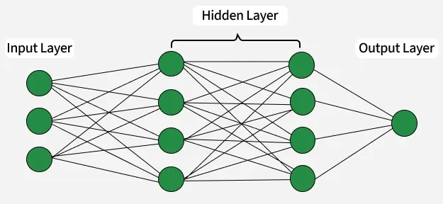

# Neural Network Architecture



## 1. What is a Layer?

A layer is a function that:

* takes data in one representation
* transforms it into another representation
* makes the final task easier

**Intuition**:
A layer is like a translator that rewrites data into a language the next layer understands better.

A neural network is simply:
- many layers composed together and optimized

Each layer transforms data into a more useful representation.

---

## 2. Types of Layers

### 2.1 Input Layer

* First layer of the network
* Receives raw data (features)
* No computation other than passing values forward

**Example**

* Image (28×28 pixels) → 784 input neurons
* Tabular data with 10 features → 10 input neurons

---

### 2.2 Hidden Layers

* Layers between input and output
* Perform feature extraction and transformation
* A network can have **one or many** hidden layers

**Key role**

* Learn patterns (edges → shapes → objects in images)
* More layers = more abstract representations

---

### 2.3 Output Layer

* Final layer of the network
* Produces the prediction

**Depends on task**

| Task                       | Neurons   | Activation |
| -------------------------- | --------- | ---------- |
| Binary classification      | 1         | Sigmoid    |
| Multi-class classification | N classes | Softmax    |
| Regression                 | 1 or more | Linear     |

---

## 3. Common Specialized Layers

### 3.1 Dense (Fully Connected) Layer

* Every neuron connects to all neurons in the previous layer
* Most common layer type
* Each output neuron looks at all inputs.

**Formula**
$
y = f(Wx + b)
$

**Intuition**:

* Mixes everything with everything
* Good at combining features

**Think**: A committee where every member listens to everyone else before deciding

**Pros**:

* Very expressive
* Simple to understand
* Works well when features are already meaningful

**Cons**:
* Parameter-heavy
* Overfits easily
* Ignores spatial / temporal structure

**When to use**:
* Small datasets
* Tabular data
* Final decision layers

**Example**:

* Final layers in classifiers
* MLPs for tabular data

---

### 3.2 Convolutional Layer (CNN)

* Used mainly for images
* Applies filters (kernels) to detect features like edges, textures
* Applies the same function (filter) across space using a sliding window.

**Intuition**:

* Looks for local patterns
* Reuses the same detector everywhere

**Think**: Using the same magnifying glass at every location

**Pros**:

* Parameter-efficient (weight tying)
* Translation-invariant
* Excellent for images, audio, video

**Cons**:

* Limited global context
* Assumes local structure

**When to use**:

* Images
* Audio spectrograms
* Spatial data

**Example**:

* Edge detection in images
* Texture and shape extraction


---

### 3.3 Pooling Layer

* Reduces spatial size
* Common types: Max Pooling, Average Pooling
* Downsamples data by summarizing regions (max / average).

**Intuition**:

* Keeps what matters most
* Throws away exact position

**Think**: Keeping headlines instead of every sentence

**Pros**:

* Reduces computation
* Adds robustness to small shifts

**Cons**:

* Loses information
* Can hurt fine-grained tasks

**When to use**:

* Vision tasks where exact location is not critical

**Example**:

* MaxPool in CNNs

---

### 3.4 Recurrent Layer (RNN, LSTM, GRU)

* Designed for sequential data
* Maintains memory of previous inputs
* Processes sequences one element at a time while maintaining state.

**Intuition**:

* Has memory
* Each step depends on the past

**Think**: Reading a sentence word by word while remembering what you read

**Pros**:

* Handles variable-length sequences
* Explicit temporal modeling

**Cons**:
* Hard to train
* Vanishing gradients
* Slow (sequential)

**When to use**:

* Short sequences
* Streaming data

**Example**:

* Speech recognition
* Time series prediction

---

### 3.5 LSTM / GRU (Gated RNNs)
* Add gates to control what to remember and forget.

**Intuition**:

* Smart memory
* Decides what is important

**Think**: Highlighting important notes while reading

**Pros**:
* Better long-range dependencies
* More stable than vanilla RNNs

**Cons**:
* Complex
* Slower than transformers

**When to use**:
* Medium-length sequences
* When transformers are too heavy

---

### 3.6 Attention Layer

Lets each element selectively focus on other elements.

**Intuition**:
* Dynamic routing of information
* No fixed notion of distance

**Think**: Skimming a document and jumping to relevant parts

**Pros**:

* Captures long-range dependencies
* Parallelizable
* Very expressive

**Cons**:

* Quadratic memory cost
* Needs lots of data

**When to use**:
* NLP
* Long sequences
* Multimodal tasks

**Example**:

* Transformers
* Language models

---
### 3.7 Transformer Block (Composite Layer)

A structured combination of:

* Attention
* Feedforward layers
* Normalization
* Residual connections

**Intuition**:
Repeated refinement of representations

**Think**: Revising a draft multiple times with feedback

**Pros**:

* State-of-the-art performance
* Flexible and scalable

**Cons**:

* Data-hungry
* Compute-intensive

**When to use**:

* Large datasets
* General-purpose representation learning

---

### 3.8 Normalization Layers (BatchNorm, LayerNorm)

Normalize activations during training.

**Intuition**:

* Stabilizes learning
* Keeps values well-behaved

**Think**: Keeping volumes at a comfortable level

**Pros**:

* Faster convergence
* More stable training

**Cons**:

* Can interact poorly with small batches

**When to use**:

* Almost always (especially deep nets)

---

### 3.9 Dropout Layer

* Randomly disables neurons during training
* Prevents overfitting

**Typical dropout rate**

* 0.2–0.5

**Intuition**:

* Forces redundancy
* Prevents co-adaptation

**Think**: Training with random teammates missing

**Pros**:

* Reduces overfitting

**Cons**:

* Slows convergence
* Less common in modern large models

**When to use**:

* Small datasets
* Dense networks

---

### 3.10 Residual Connections (Skip Connections)
Add the input of a layer to its output.

**Intuition**:

* Makes learning corrections easier

**Think**: Editing instead of rewriting from scratch

**Pros**:

* Enables very deep networks
* Improves gradient flow

**Cons**:

* Slight architectural complexity

**When to use**:

* Deep networks
* Transformers, ResNets

---

### 3.11 Graph Neural Network (GNN) Layer

Processes graph-structured data by passing messages between connected nodes.

**Intuition**:

* Learns from relationships, not just features
* Each node updates itself using information from its neighbors

**Think**: Learning by talking to your friends, then your friends' friends

**Pros**:

* Naturally handles graphs
* Permutation-invariant
* Captures relational structure

**Cons**:

* Over-smoothing in deep GNNs
* Expensive on large graphs
* Hard to scale

**When to use**:

* Data is inherently relational
* Connections matter more than order or distance

**Example**:

* Social networks (friend recommendation)
* Molecule property prediction
* Knowledge graphs

---

## 4. Activation Functions (Used Inside Layers)

* **ReLU** → Most common in hidden layers
* **Sigmoid** → Binary outputs
* **Tanh** → Centered activation
* **Softmax** → Multi-class probability output

---

## 5. Depth vs Width

* **Depth**: Number of layers
* **Width**: Number of neurons per layer

**Trade-off**

* Deep networks learn complex features
* Very deep → risk of vanishing gradients
* Wide networks → more parameters, higher cost

---

## 6. Layer Arrangement Example

**Image Classification CNN**

```
Input → Conv → ReLU → Pool → Conv → Pool → Dense → Output
```

**Simple Feedforward Network**

```
Input → Dense → ReLU → Dense → Output
```

---

## 7. Why Layers Matter

* Early layers: learn simple patterns
* Middle layers: learn combinations
* Deep layers: learn high-level abstractions

👉 This hierarchical learning is why deep learning works so well.

---

## 8. Summary

* Layers are the building blocks of neural networks
* Each layer transforms data
* Choice of layer type depends on data and task
* Good architecture balances depth, width, and regularization
