# Activation Functions

## 1. What is an Activation Function?

Activation functions are a critical component of neural networks that introduce non-linearity into the model, allowing networks to learn complex patterns and relationships in the data. These functions play an important role in the hyperparameters of AI-based models. 

An **activation function** decides:

* whether a neuron should activate
* how strong its output should be

Mathematically, it transforms the weighted sum of inputs before passing it to the next layer.

Without activation functions, a neural network becomes just a **linear model**, no matter how many layers it has.

$z = \sum (w_i x_i) + b,\quad a = f(z)$

It decides how much information passes forward. Without activation functions, a neural network becomes just a **linear model**, no matter how many layers it has.

---

## 2. Why Activation Functions Are Essential

Activation functions are necessary for neural networks because, without them, the output of the model would simply be a linear function of the input. In other words, it wouldn’t be able to handle large volumes of complex data. Activation functions are an additional step in each forward propagation layer but a valuable one. 

Activation functions:

* Introduce **non-linearity**
* Enable **deep feature learning**
* Make **backpropagation meaningful**
* Allow neural networks to model **complex real-world patterns** (images, language, audio)

> Without non-linearity, deep learning would not exist .

---

## 3. Where Activation Functions Are Used

* **Input layer:** no activation
* **Hidden layers:** usually ReLU or its variants
* **Output layer:** depends on task (regression vs classification)

Rule of thumb from practice:

* Hidden layers → ReLU / GELU
* Output layer → task-specific activation

---

## 4. Categories of Activation Functions

### A. Linear Activation Functions

#### 1. Linear Activation Function (Identity)

n deep learning, data scientists use linear activation functions, also known as identity functions, when they want the output to be the same as the input signal. Identity is differentiable, and like a train passing through a station without stopping, this activation function doesn’t change the signal in any way, so it’s not used within internal layers of a DL network. 

Although, in most cases, this might not sound very useful, it is when you want the outputs of your neural network to be continuous rather than modified or discrete. There is no convergence of data, and nothing decreases either. If you use this activation function for every layer, then it would collapse the layers in a neural network into one. So, not very useful unless that’s exactly what you need or there are different activation functions in the subsequent hidden layers. 

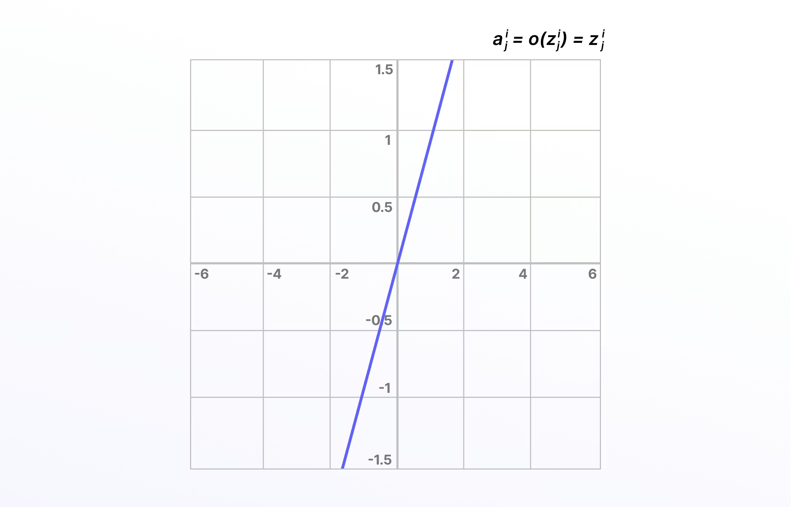

* Output = input
* Used mainly for **regression outputs**
* Not used in hidden layers

**Formula**:

$f(x) = x$

**Pros**:

* ✔ Simple
* ✔ No saturation

**Cons**:

* No non-linearity
* Not useful in hidden layers
* Cannot learn complex patterns

**When to Use**:

* Output layer for regression

**Example**:

* Predicting house prices, temperature, stock values.

---
#### 2. Piecewise Linear (PL)

Piecewise linear is an iteration on the above, except involving an affine function, so it is also known as piecewise affine. It’s defined using a bound or unbound sequence of numbers, either compact, finite, or locally finite, and is not differentiable due to threshold points, so it only propagates signals in the slope region. 

Piecewise linear is calculated using a range of numbers required for the particular equation, anything less than the range is 0, and anything greater is 1. Between 0 and 1, the signals going from one layer to the next are linearly-interpolated.

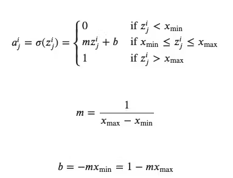

Linear activation functions don’t allow neural networks or deep learning networks to develop complex mapping and algorithmic interpretation between inputs and outputs. 

---

### B. Non-Linear Activation Functions (Most Important)

Non-linear activation functions solve the limitations and drawbacks of simpler activation functions, such as the vanishing gradient problem. Non-linear functions, such as Sigmoid, Tanh, Rectified Linear Unit (ReLU), and numerous others. 

There are several advantages to using non-linear activation functions, as they can facilitate backpropagation and stacking. Non-linear combinations and functions used throughout a network mean that data scientists and machine learning teams creating and training a model can adjust weights and biases, and outputs are represented as a functional computation. 

In other words, everything going into, through, and out of a neural network can be measured more effectively when non-linear activation functions are used, and therefore, the equations are adjusted until the right outputs are achieved. 

---

#### 1. Binary Step Function

The binary step function is a door that only opens when a specific threshold value has been met. When an input is above that threshold, the neuron is activated, and when not, it’s deactivated. 

Once a neuron is activated then, the output from the previous layer is passed onto the next stage of the neural network’s hidden layers. 

Binary step is purely threshold-based, and of course, it has limitations, such as it not being differentiable and it can’t backpropogate signals. It can’t provide multi-value outputs or multi-class classification problems when there are multiple outputs. 

However, for fairly simple neural networks, the binary step is a useful and easy activation function to incorporate. 

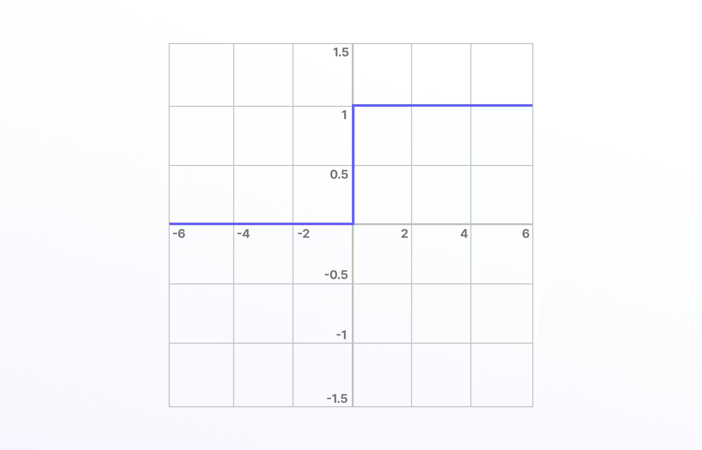

* Output is 0 or 1
* Not differentiable
* Cannot be trained using gradient descent

Used historically (Perceptron), **rarely used today** .

**Formula**:

$
f(x)=\begin{cases}1, & x \ge 0 \\
0, & x < 0\end{cases}
$

**Pros**:

* Simple logic

**Cons**:
* Not differentiable
* No gradient descent
* Obsolete for deep learning

**When to Use**:

* Very simple perceptron models

**Example**:

* Early rule-based classifiers.

---

#### 2. Sigmoid (Logistic) 

‌The Sigmoid activation function, also known as the logistic activation function, takes inputs and turns them into outputs ranging between 0 and 1. For this reason, sigmoid is referred to as the “squashing function” and is differentiable. Larger, more positive inputs should produce output values close to 1.0, with smaller, more negative inputs producing outputs closer to 0.0. 

It’s especially useful for classification or probability prediction tasks so that it can be implemented into the training of computer vision and deep learning networks. However, vanishing gradients can make these problematic when used in hidden layers, and this can cause issues when training a model.

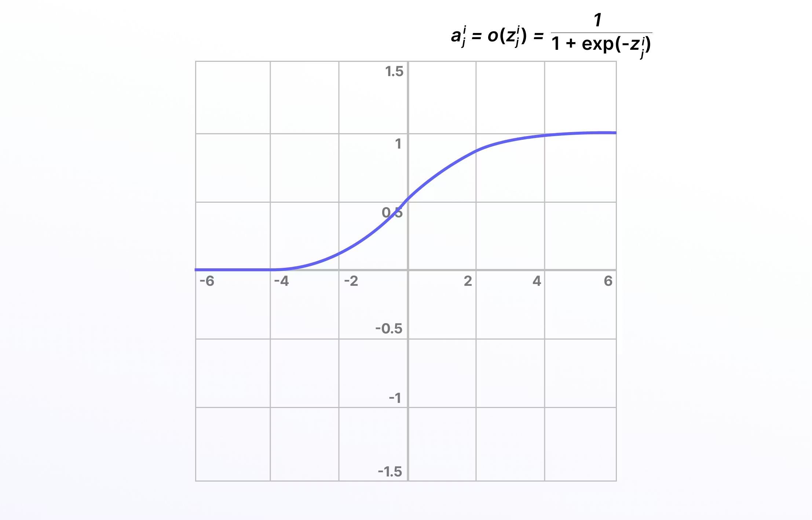

* Range: (0, 1)
* Used for **binary classification outputs**
* Interpretable as probability

**Formula**:

$
f(x) = \frac{1}{1 + e^{-x}}
$

**Output Range**

$(0, 1)$

**Pros**:

* Smooth
* Probabilistic interpretation

**Cons**:
* Vanishing gradient*
* Slow training
* Not zero-centered

**When to Use**:

* Binary classification output layer
* Probability estimation

**Example**:

* Spam vs not-spam classifier.

👉 Modern use: **only in output layer**, not hidden layers

---

#### 3. Tanh (Hyperbolic Tangent)

Tanh (or TanH), also known as the hyperbolic tangent activation function, is similar to sigmoid/logistic, even down to the S shape curve, and it is differentiable. Except, in this case, the output range is -1 to 1 (instead of 0 to 1). It is a steeper gradient and also encounters the same vanishing gradient challenge as sigmoid/logistic. 

Because the outputs of tanh are zero-centric, the values can be more easily mapped on a scale between strongly negative, neutral, or positive. 

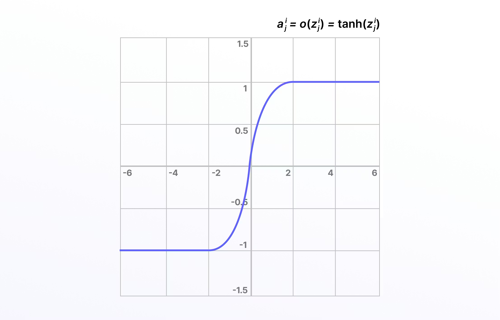

* Range: (−1, 1)
* Zero-centered (better than sigmoid)

**Formula**:

$f(x) = \tanh(x) = \frac{e^x - e^{-x}}{e^x + e^{-x}}$

**Output Range**:

$(-1, 1)$

**Pros**:

* Zero-centered
* Stronger gradients than sigmoid

**Cons**:

* Vanishing gradient
* Slower than ReLU

**Example**

* Sentiment analysis with RNNs.

👉 Used sometimes in **RNNs**, rarely in deep CNNs

---

#### 4. ReLU (Rectified Linear Unit)

Compared to linear functions, the rectified linear unit (ReLU) is more computationally efficient For many years, researchers and data scientists mainly used Sigmoid or Tanh, and then when ReLU came along, training performance increased significantly. ReLU isn’t differentiable, but this isn’t a problem because derivatives can be generated for ReLU. 

ReLU doesn’t activate every neuron in sequence at the same time, making it more efficient than the tanh or sigmoid/logistic activation functions. Unfortunately, the downside of this is that some weights and biases for neurons in the network might not get updated or activated. 

This is known as the “dying ReLU” problem, and it can be solved in a number of ways, such as using variations on this formula, including the exponential ReLU or parametric ReLU function. 

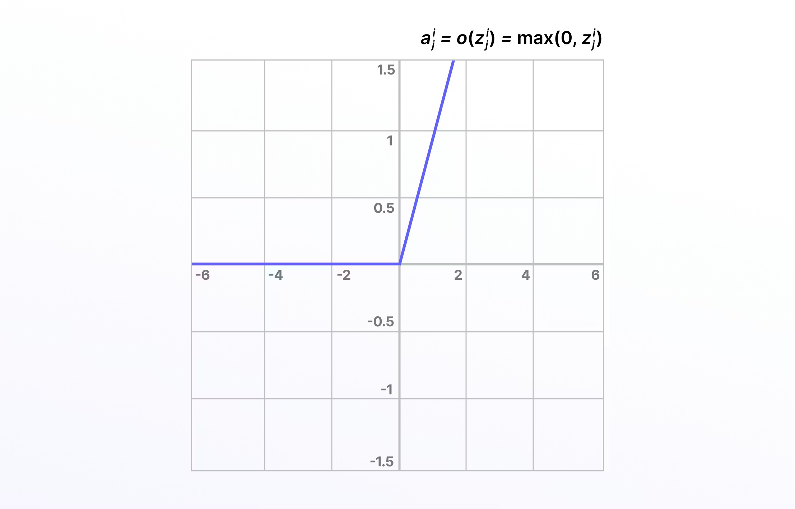

* f(x) = max(0, x)
* Fast, simple, efficient
* Most common hidden-layer activation

**Formula**:

$f(x) = \max(0, x)$

**Pros**:

* Fast
* Sparse activation
* No vanishing gradient (for x > 0)

**Cons**:

* Dying ReLU problem
* Not differentiable at 0

**Example**:

* Image classification (CNNs).

---

#### 5. Leaky ReLU

One solution to the “dying ReLU” problem is a variation on this known as the Leaky ReLU activation function. With the Leaky ReLU, instead of being 0 when 𝑧<0, a leaky ReLU allows a small, non-zero, constant gradient 𝛼 (Normally, 𝛼=0.01). 

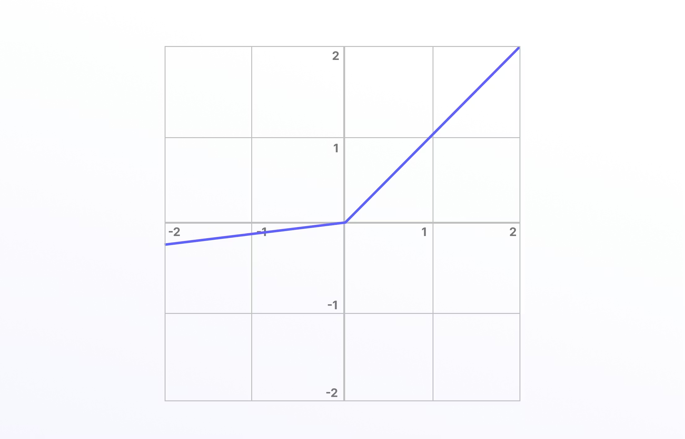

Leaky ReLU has been shown to perform better than the traditional ReLU activation function. However, because it possesses linearity it can’t be used for more complex classification tasks and lags behind more advanced activation functions such as Sigmoid and Tanh

* Allows small negative values
* Fixes dying ReLU partially

**Formula**:

$f(x) =\begin{cases}x, & x > 0 \\ \alpha x, & x \le 0\end{cases}\quad (\alpha \approx 0.01)$

**Pros**:
* Fixes dying ReLU

**Cons**:

* Still linear on both sides

**Example**:

* Deep CNNs with unstable training.

---

#### 6. Parametric ReLU (PReLU)

Parametric ReLU is another iteration of ReLU (an advance on the above, Leaky ReLU) except with a parameterized slope α, and is also not differentiable. 

Again, this activation function generally outperforms ReLU especially when used for image classification tasks in deep learning. Parametric ReLU reduces the number of parameters required to achieve higher levels of performance and is a feature of numerous deep learning architectures and models such as ResNet, DenseNet, and Alexnet. 

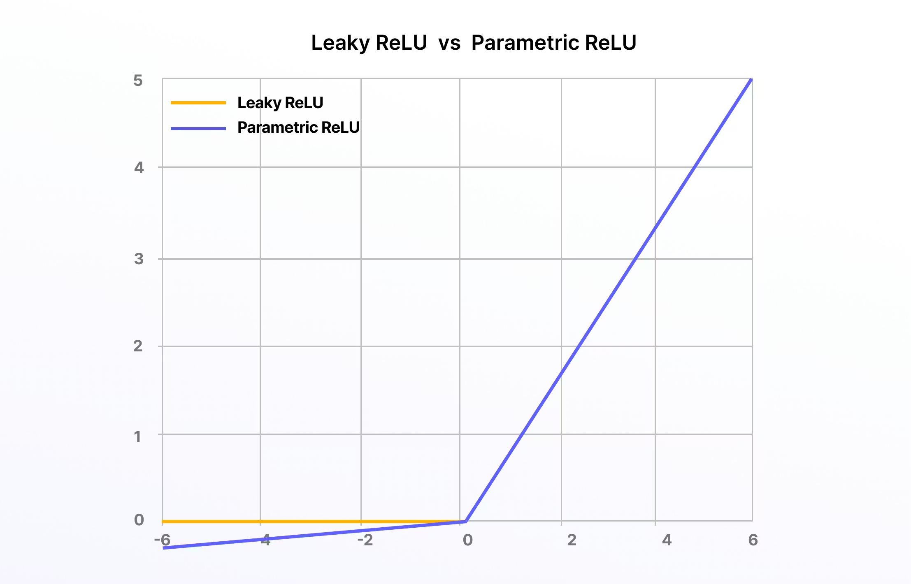

* Learns the negative slope
* Used in models like **ResNet**

**Formula**:

$f(x) =\begin{cases}x, & x > 0 \\ \alpha x, & x \le 0\end{cases}\quad (\alpha \text{ learned})$

**Pros**:

* Learnable flexibility
* Better accuracy

**Cons**:

* More parameters
* Risk of overfitting

**When to Use**:

* Large CNNs (ResNet, DenseNet)

---

#### 7. ELU (Exponential Linear Unit)

The exponential linear units (ELUs) function is another iteration on the original ReLU, another way to overcome the “dying ReLU” problem, and it’s also not differentiable. ELUs use a log curve for negative values instead of a straight line, with it becoming smooth slowly until it reaches -α. 

* Smooth negative curve
* Better gradient flow
* Slower than ReLU

**Formula**:

$f(x) =\begin{cases}x, & x > 0 \\ \alpha(e^x - 1), & x \le 0\end{cases}$

**Pros**:

* Smooth negative region
* Faster convergence

**Cons**:

* Computationally expensive

**When to Use**:

* When smooth gradients are needed

---

#### 8. Scaled Exponential Linear Units (SELUs)

Scaled exponential linear units (SELUs) first appeared in this 2017 paper. Similar to ELUs, the scaled version of this is also attempting to overcome the same challenges of ReLUs.  

SELUs control the gradient more effectively and scale the normalization concept, and that is scales with a lambda parameter. SELUs remove the problem of vanishing gradients, can’t die (unlike ReLUs), and learn faster and better than other more limited activation functions. 

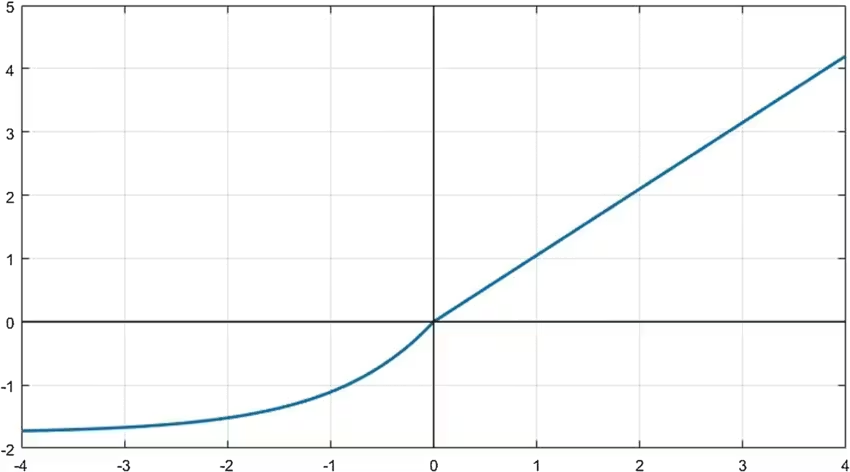

* Self-normalizing
* Prevents vanishing gradients
* Requires specific initialization

**Formula**:

$\text{selu}(x) = \lambda\begin{cases}x, & x > 0 \\ \alpha(e^x - 1), & x \le 0\end{cases}$

**Pros**:

* No vanishing gradient
* Stable training

**Cons**:

* Requires specific initialization

**When to Use**:

* Self-normalizing networks

👉 Rare in practice unless architecture is designed for it .

---

## 3. Modern & Advanced Activation Functions

#### 1. GELU (Gaussian Error Linear Unit)

Now we get into an activation function that’s compatible with top, mass-scale natural language processing (NLPs) and large language models (LLMs) like ChatGPT-3, BERT, ALBERT, and ROBERTa. 

Gaussian error linear units (GELUs) are part of the Gaussian function mathematical family. GELUs combines properties and inspiration from ReLUs, dropout, and zoneout and is considered a smoother version of ReLU.

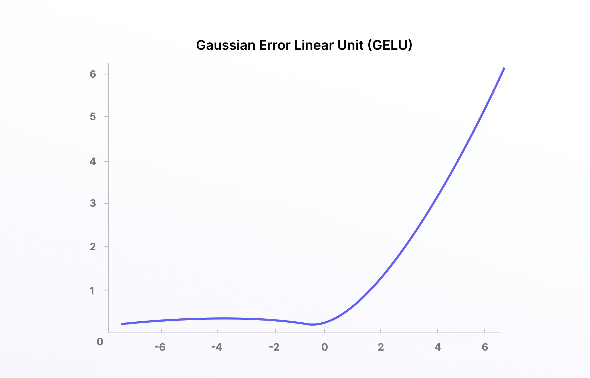

* Used in **transformers & LLMs**
* Smooth, probabilistic behavior
* Combines ideas from ReLU + dropout

👉 Used in:

* BERT
* GPT
* RoBERTa

This is **state-of-the-art for NLP models** .

**Formula**

$\text{GELU}(x) = x \cdot \Phi(x)$

Approximation:

$0.5x\left(1 + \tanh\left(\sqrt{\frac{2}{\pi}}(x + 0.044715x^3)\right)\right)$

**Pros**:

* Smooth
* Probabilistic gating
* Best for LLMs

**Cons**:

* More computation

**When to Use**:

* Transformers
* NLP models
* Large Language Models

**Example**:
BERT, GPT, RoBERTa

---

#### 2. SoftSign

Soft sign is equally useful in statistics and other related fields. It’s a continuous and differentiable activation function with a range from -1 to 1, so it can be used to model bipolar data while being computationally efficient. 

Soft sign is often applied to find the maximum likelihood estimation (MLE) when data scientists are searching for other suitable activation functions that fit the training data being used.

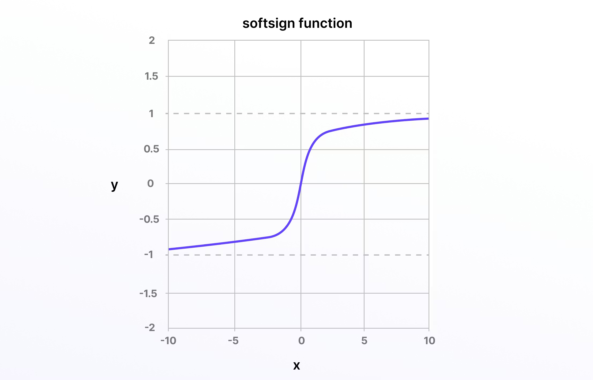

* Smooth alternative to tanh
* Range: (−1, 1)
* Rarely used in production

**Formula**:

$f(x) = \frac{x}{|x| + 1}$

**Pros**:

* Smooth
* Cheap computation

**Cons**:

* Rarely used

**When to Use**:

* Alternative to tanh

---

#### 3. SoftPlus

Soft Plus takes Soft Sign a little further, making it an equally, if not even more, useful activation function for neural networks.

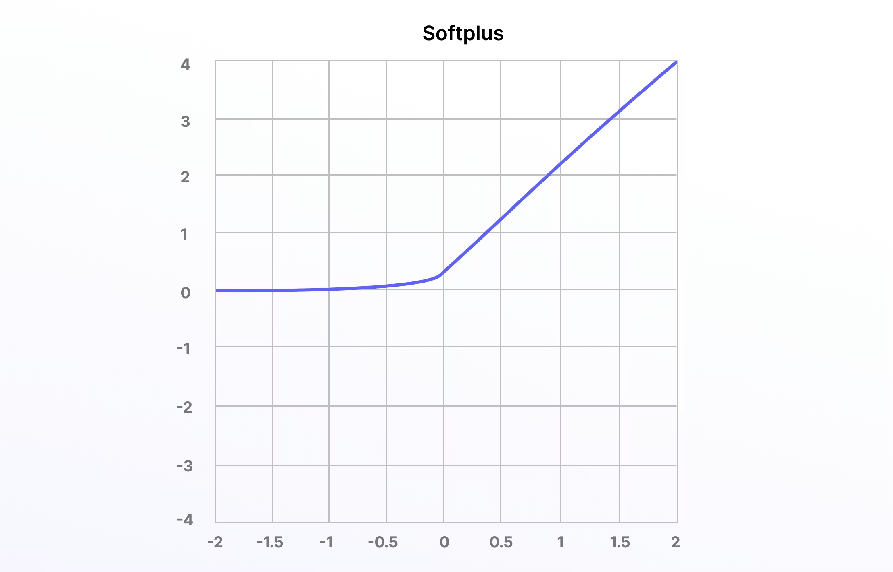

* Smooth approximation of ReLU
* Differentiable everywhere
* Slower than ReLU

**Formula**:

$f(x) = \ln(1 + e^x)$

**Pros**:
* Differentiable everywhere

**Cons**:

* Slower than ReLU

**When to Use**:

* Smooth ReLU replacement

---

#### 4. Probit 

Last on this list (although there are many more; e.g., Leaky ReLU, Softmax, etc.) is probit, a quantile function that’s associated with the standard normal distribution and works as an activation function in neural networks and machine learning models. 

Probit started life as a “probability unit” in statistics in 1934, first introduced by Chester Ittner Bliss. 

Here is the mathematical representation: 

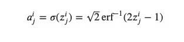

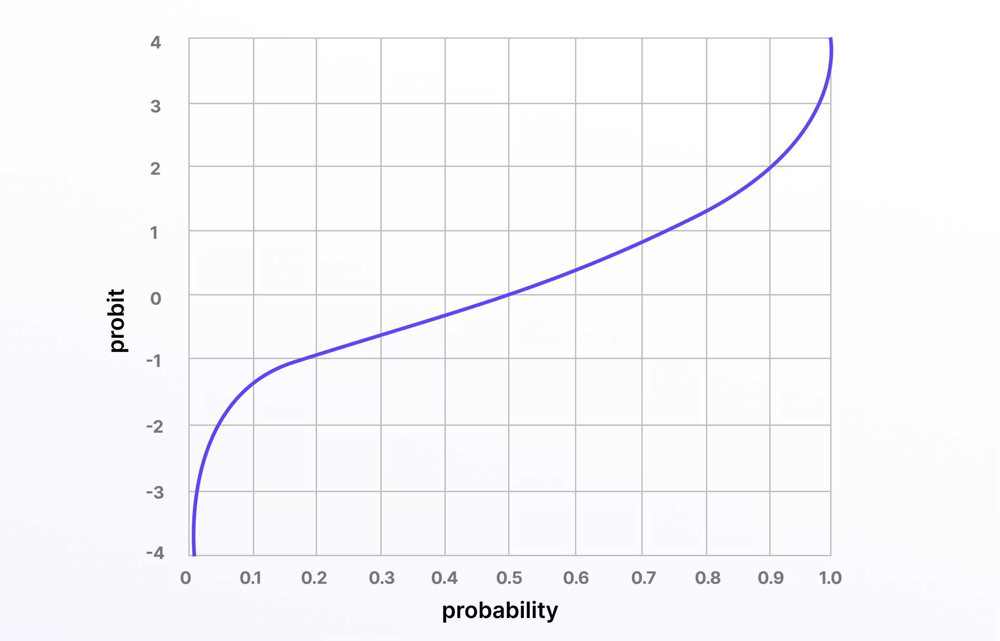

---

## 4. Output Layer Activation Functions (Very Important)

#### 1. Softmax

The softmax function, also known as the softargmax function and the multi-class logistic regression, is one of the most popular and well-used differentiable layer activation functions. 

Softmax turns input values that are positive, negative, zero, or greater than one into values between 0 and 1. By doing this, it turns input scores into a normalized probability distribution, making softmax a useful activation function in the final layer of deep learning and artificial neural networks. 

* Converts scores into probabilities
* Used for **multi-class classification**
* Outputs sum to 1

**Formula**:

$\sigma(z_i) = \frac{e^{z_i}}{\sum_{j=1}^{K} e^{z_j}}$

**Pros**:

* Produces probabilities
* Differentiable

**Cons**:

* Sensitive to large values

**When to Use**:

* Multi-class classification output

**Example**:

* Digit classification (0–9).

---

#### 2. Sigmoid (Output)

* Binary classification
* Multi-label classification

---

#### 3. Linear (Identity)

* Regression tasks
* Continuous outputs

---

## 9. How to Choose the Right Activation Function (Cheat Sheet)

| Task                       | Hidden Layers  | Output Layer |
| -------------------------- | -------------- | ------------ |
| Regression                 | ReLU           | Linear       |
| Binary Classification      | ReLU           | Sigmoid      |
| Multi-class Classification | ReLU           | Softmax      |
| CNN (Images)               | ReLU / PReLU   | Task-based   |
| RNN                        | Tanh / Sigmoid | Task-based   |
| Transformers / LLMs        | GELU           | Softmax      |

---

## 10. Extra Practical Knowledge

### ✅ Default Choice in Practice

> **If unsure → use ReLU in hidden layers**

This works well 80–90% of the time.

---

### ✅ Activation ≠ Loss Function

Common confusion:

* Activation → shapes neuron output
* Loss → measures prediction error

Example:

* Softmax + Cross-Entropy (classification)
* Linear + MSE (regression)

---

### ✅ Activation Functions Affect Training Speed

* Sigmoid/Tanh → slower training
* ReLU/GELU → faster convergence

---

### ✅ Why GELU Beats ReLU in LLMs

* ReLU is deterministic (hard cutoff)
* GELU is probabilistic (soft gating)
* Better gradient flow for large models

---

## 11. One-Line Summary

> **Activation functions give neural networks the ability to think non-linearly, learn complex patterns, and power modern AI systems.**