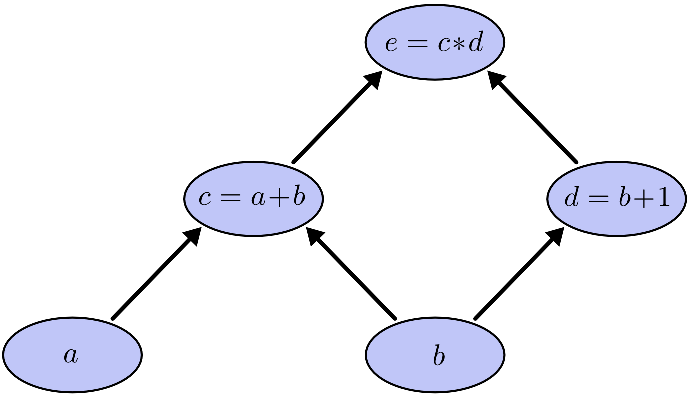
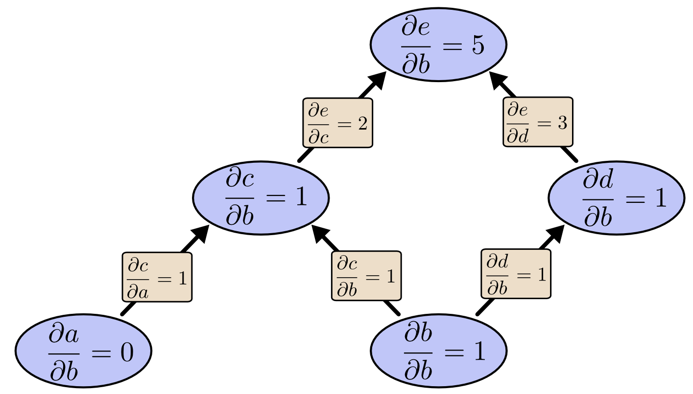
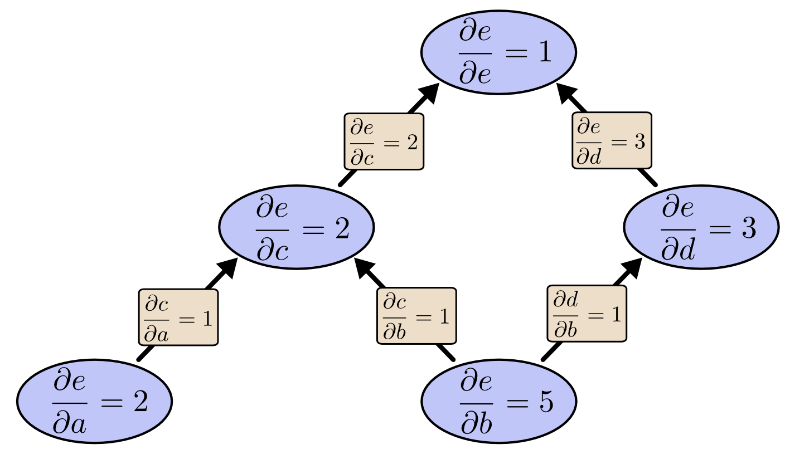
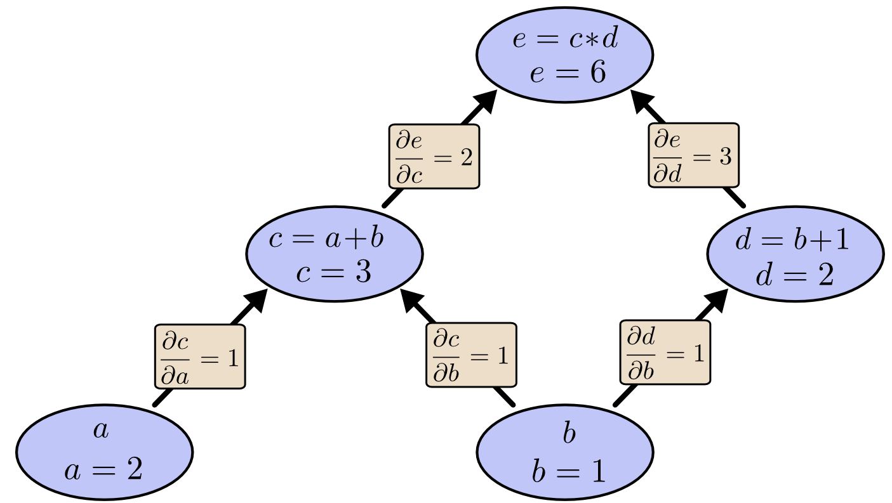

# Backpropagation

## 1. What Is Backpropagation?

**Backpropagation** is an efficient algorithm for computing **gradients of a scalar output with respect to many inputs**.
In deep learning, the output is usually a **loss function**, and the inputs are **millions of parameters (weights and biases)**.

Formally, backpropagation is **reverse-mode automatic differentiation**, applied to neural networks .

Why it matters:

* A naive derivative computation would be **astronomically slow**
* Backprop reduces computation from exponential (paths) to **linear in graph size**
* Makes modern deep learning feasible at all 

---

## 2. Computational Graphs: The Core Abstraction

The article frames everything using **computational graphs**, which is the key mental model.

### 2.1 What is a Computational Graph?

A computational graph:

* Nodes = variables or operations
* Edges = data flow / dependency
* Direction = forward computation order

Example:

$
e = (a + b)(b + 1)
$

Break into steps:

* $( c = a + b )$
* $( d = b + 1 )$
* $( e = c \cdot d )$

This forms a **Directed Acyclic Graph (DAG)** .

Why this matters:

* Any neural network (MLP, CNN, Transformer) can be represented this way
* Backprop works on **graphs**, not just neural nets

---

## 3. Derivatives on Computational Graphs

To evaluate the partial derivatives in this graph, we need the sum rule and the product rule:

$
\frac{\partial}{\partial a}(a + b)
= \frac{\partial a}{\partial a} + \frac{\partial b}{\partial a}
= 1
$

$
\frac{\partial}{\partial u}(uv)
= u \frac{\partial v}{\partial u} + v \frac{\partial u}{\partial u}
= v
$

### 3.1 Local Derivatives (Edges)

Each edge stores a **local derivative**:

* Addition: derivative = 1
* Multiplication: derivative depends on the other operand

Example:

* $( \frac{\partial c}{\partial a} = 1 )$
* $( \frac{\partial e}{\partial c} = d )$
* $( \frac{\partial e}{\partial d} = c )$ 

These are **simple, local rules**.

---

### 3.2 Global Derivatives = Sum Over Paths

To compute how one variable affects another:

* Enumerate **all paths** between them
* Multiply derivatives along each path
* Sum over paths

Example:
$
\frac{\partial e}{\partial b} =
\frac{\partial e}{\partial c}\frac{\partial c}{\partial b}
+
\frac{\partial e}{\partial d}\frac{\partial d}{\partial b}
$

This is just the **multivariable chain rule**, reinterpreted graphically .

⚠️ Problem:
Number of paths can grow **exponentially** (page 3).

---

## 4. The Path Explosion Problem

The article highlights a key insight:

> “Summing over paths directly leads to a combinatorial explosion.” 

If:

* 3 paths from X → Y
* 3 paths from Y → Z

Then:

* 9 paths from X → Z

In deep networks, this becomes **millions or billions** of paths.

So what’s the trick?

---

## 5. Factoring Paths = Automatic Differentiation

Instead of enumerating paths:

* **Factor common subpaths**
* Reuse intermediate results
* Apply **dynamic programming**

This gives two algorithms:

1. **Forward-mode differentiation**
2. **Reverse-mode differentiation (Backprop)**

---

## 6. Forward-Mode vs Reverse-Mode Differentiation

### 6.1 Forward-Mode Differentiation

* Tracks how **one input** affects **all nodes**
* Starts at inputs, moves forward
* Efficient when:

  * Few inputs
  * Many outputs

Mathematically:
$
\frac{\partial \text{(everything)}}{\partial x}
$

---

### 6.2 Reverse-Mode Differentiation (Backpropagation)

* Tracks how **all nodes** affect **one output**
* Starts at the output, moves backward
* Efficient when:

  * Many inputs (parameters)
  * One output (loss)

This is exactly the deep learning setup .

---

## 7. Why Backprop Is Perfect for Neural Networks

Neural network training:

* Inputs: millions of parameters
* Output: single scalar loss

Forward-mode:

* Would require **one pass per parameter**
* Totally infeasible

Reverse-mode (backprop):

* **One forward pass** (compute values)
* **One backward pass** (compute all gradients)
* Complexity ≈ 2× forward computation 

That’s why training takes **hours instead of centuries**.

---

## 8. Backpropagation Algorithm (Conceptual Steps)

### Step 1: Forward Pass

* Compute values of all nodes
* Cache intermediate activations

### Step 2: Initialize Gradient at Output

$
\frac{\partial L}{\partial L} = 1
$

### Step 3: Backward Pass (Chain Rule)

For each node:
$
\frac{\partial L}{\partial x} =
\sum_{\text{children } y}
\frac{\partial L}{\partial y}
\cdot
\frac{\partial y}{\partial x}
$

This is the **core backprop equation**.

### Step 4: Parameter Update

Using gradient descent:
$
\theta \leftarrow \theta - \eta \frac{\partial L}{\partial \theta}
$

---

## 9. Backprop as Dynamic Programming

The article emphasizes a deep insight:

> Backpropagation is dynamic programming on graphs. 

Why?

* Subproblems = partial derivatives at nodes
* Overlapping computations reused
* Each edge touched **once**

This is why derivatives are “cheaper than you think” .

---

## 10. Conceptual Intuition (Very Important)

Backprop answers one question repeatedly:

> “If I change this number slightly, how much does it affect the final loss?”

Gradients are:

* Sensitivity signals
* Error responsibility scores
* Credit assignment mechanism

Each parameter learns **how guilty it is** for the error.

---

## 11. Common Misconceptions

### ❌ “Backprop is just the chain rule”

✔️ True, but misleading.

The chain rule alone doesn’t explain:

* Efficiency
* Graph structure
* Dynamic programming reuse

The *algorithmic insight* is the real breakthrough .

---

### ❌ “Backprop only works for neural networks”

✔️ False.

Backprop = reverse-mode autodiff:

* Used in physics
* Control systems
* Optimization
* Scientific computing

Neural networks just made it famous.

---

## 12. Practical Implications in Deep Learning

Backprop helps explain:

* **Vanishing gradients** (gradients shrink through many multiplications)
* **Exploding gradients**
* Why activation functions matter
* Why residual connections help
* Why normalization stabilizes training

As the article notes, backprop is a **lens for understanding optimization difficulty** .

---

## 13. Final Takeaways

1. Backpropagation = **reverse-mode differentiation**
2. Operates on **computational graphs**
3. Computes gradients in **linear time**
4. Uses:

   * Chain rule
   * Dynamic programming
   * Path factoring
5. Makes deep learning **computationally possible**

> **Derivatives are unintuitively cheap — if you compute them the right way.** 

---

## Example 1: Backpropagation on a Simple Computational Graph

We use the **same example as the article**, but now compute everything explicitly.

### Problem

$
e = (a + b)(b + 1)
$

---

## Step 1: Build the Computational Graph

Introduce intermediate variables:

* ( c = a + b )
* ( d = b + 1 )
* $( e = c \cdot d )$

---

## Step 2: Forward Pass (Compute Values)

Let:

* ( a = 2 )
* ( b = 1 )

Compute forward:

$
\begin{aligned}
c &= a + b = 2 + 1 = 3 \
d &= b + 1 = 1 + 1 = 2 \
e &= c \cdot d = 3 \cdot 2 = 6
\end{aligned}
$

So the output is:
$
e = 6
$

---

## Step 3: Local Derivatives (Edge Gradients)

Now compute **local derivatives** at each operation:

### Addition

$
\frac{\partial c}{\partial a} = 1, \quad
\frac{\partial c}{\partial b} = 1
$

### Addition

$
\frac{\partial d}{\partial b} = 1
$

### Multiplication

$
\frac{\partial e}{\partial c} = d = 2, \quad
\frac{\partial e}{\partial d} = c = 3
$

---

## Step 4: Backward Pass (Chain Rule)

We now propagate gradients **from output to inputs**.

### Initialize at Output

$
\frac{\partial e}{\partial e} = 1
$

---

### Gradient w.r.t. ( c )

$
\frac{\partial e}{\partial c}
= \frac{\partial e}{\partial e}
\cdot
\frac{\partial e}{\partial c}
= 1 \cdot 2 = 2
$

---

### Gradient w.r.t. ( d )

$
\frac{\partial e}{\partial d}
= 1 \cdot 3 = 3
$

---

### Gradient w.r.t. ( a )

Only one path:
$( a \rightarrow c \rightarrow e )$

$
\frac{\partial e}{\partial a} =
\frac{\partial e}{\partial c}
\cdot
\frac{\partial c}{\partial a} =
2 \cdot 1 = 2
$

---

### Gradient w.r.t. ( b )

⚠️ Two paths:

1. $( b \rightarrow c \rightarrow e )$
2. $( b \rightarrow d \rightarrow e )$

So we **sum over paths**:

$
\begin{aligned}
\frac{\partial e}{\partial b}
&=
\frac{\partial e}{\partial c}\frac{\partial c}{\partial b}
+
\frac{\partial e}{\partial d}\frac{\partial d}{\partial b} \
&=
(2 \cdot 1) + (3 \cdot 1) = 5
\end{aligned}
$

✔ This matches the article exactly (page 2–4) .

---

## Final Gradients

$
\boxed{
\frac{\partial e}{\partial a} = 2, \quad
\frac{\partial e}{\partial b} = 5
}
$

---

## What This Example Teaches

* Gradients **flow backward**
* Nodes with multiple outgoing paths **accumulate gradients**
* Each edge is used **once**
* This *is* the chain rule — but **organized algorithmically**

---

# Example 2: Backpropagation in a Single Neuron (Neural Network View)

Now let’s connect this directly to **deep learning**.

---

## Problem: One Neuron + Loss

### Forward Equation

$
\begin{aligned}
z &= wx + b \
\hat{y} &= z \quad \text{(identity activation)} \
L &= \frac{1}{2}(\hat{y} - y)^2
\end{aligned}
$

Where:

* ( w ) = weight
* ( b ) = bias
* ( x ) = input
* ( y ) = true label

---

## Step 1: Forward Pass (Numerical)

Let:

* ( x = 2 )
* ( w = 3 )
* ( b = 1 )
* ( y = 4 )

Compute:

$
\begin{aligned}
z &= 3 \cdot 2 + 1 = 7 \\
\hat{y} &= 7 \\
L &= \frac{1}{2}(7 - 4)^2 = \frac{9}{2}
\end{aligned}
$

---

## Step 2: Backward Pass

### Loss Gradient

$
\frac{\partial L}{\partial \hat{y}} = \hat{y} - y = 3
$

---

### Gradient w.r.t. ( z )

$
\frac{\partial L}{\partial z} = 3
$

---

### Gradient w.r.t. Weight ( w )

$
\frac{\partial L}{\partial w} =
\frac{\partial L}{\partial z}
\cdot
\frac{\partial z}{\partial w} =
3 \cdot x =
6
$

---

### Gradient w.r.t. Bias ( b )

$
\frac{\partial L}{\partial b} =
\frac{\partial L}{\partial z}
\cdot
1 =
3
$

---

## Step 3: Gradient Descent Update

With learning rate $( \eta = 0.1 )$:

$
\begin{aligned}
w &\leftarrow 3 - 0.1(6) = 2.4 \
b &\leftarrow 1 - 0.1(3) = 0.7
\end{aligned}
$

✔ This is **exactly backpropagation**, just on a tiny graph.

---

## Key Insight Connecting Both Examples

* Both examples use:

  * Computational graphs
  * Local derivatives
  * Reverse accumulation
* Neural networks are just **very large graphs**
* Backprop scales because it **reuses partial derivatives**

As the article emphasizes:

> Reverse-mode differentiation computes all parameter gradients in one backward sweep .

---

## Final Mental Model (Exam-Gold)

> **Backpropagation = backward flow of sensitivity signals through a computational graph, using the chain rule and dynamic programming.**
